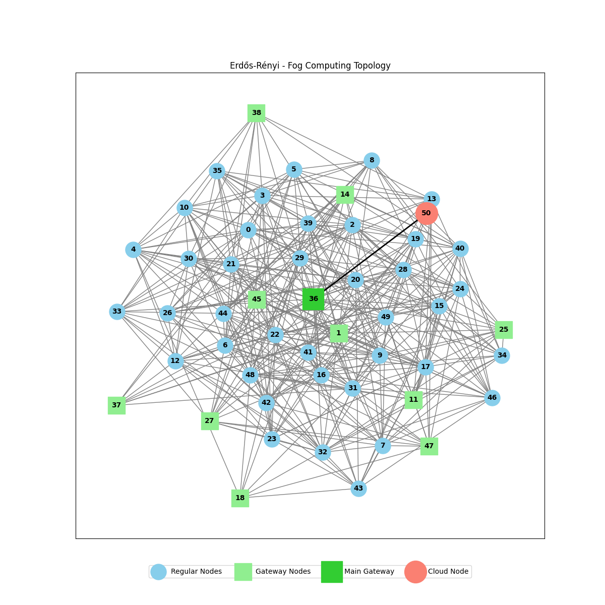

# FogSim-NX: Fog Computing Simulation Framework


FogSim-NX is a NetworkX-based simulation framework for fog computing, designed to model and optimize resource allocation in fog environments. It supports Erdős-Rényi topologies and two allocation algorithms—Neighbor-Aware and Particle Swarm Optimization (PSO)—to optimize makespan, energy consumption, and cost.

## Features

- Topology Generation: Create Erdős-Rényi fog topologies with configurable node and edge parameters.
- Allocation Algorithms:
  - Neighbor-Aware: Fast, local resource allocation with load balancing.
  - Particle Swarm Optimization (PSO): Global optimization for resource efficiency.
- Multi-Objective Optimization: Balances makespan, energy, and cost.
- Metrics: Tracks CPU, RAM, storage, bandwidth, latency, workload, energy, and cost.
- Visualization: Generates topology images (e.g., `Topology/topology_n*.png`).
- Export: Saves results to CSV files in the `Results/` folder.
- Configuration: Customizable via `config.ini`.

## Allocation Algorithms

- Neighbor-Aware is faster, locally optimal, and suited for real-time allocation but may rely more on the cloud, increasing costs and latency.
- PSO is slower, globally optimal, and better for batch processing, minimizing cloud usage and balancing multiple objectives (makespan, energy, cost).

## Example Topology



The image above shows a generated Erdős-Rényi topology with regular fog nodes (blue), gateway nodes (green), main gateway (lime green), and external cloud (red).

## Installation

1. Clone the Repository:
   ```bash
   git clone https://github.com/stefanos8569/FogSim-NX.git
   cd FogSim-NX
   ```

2. Install Dependencies:
   ```bash
   pip install networkx matplotlib numpy configparser pathlib
   ```

3. Verify Setup:
   Ensure Python 3.8+ is installed:
   ```bash
   python --version
   ```

## Quick Start

1. Edit Configuration (Optional):
   - Open `config.ini` in Visual Studio Code or any text editor.
   - Adjust topology, application, energy, or cost parameters as needed.

2. Run the Simulation:
   ```bash
   python FogSim-NX.py
   ```

3. Follow Prompts:
   - Choose to create a new topology or load an existing one (`Topology/*.graphml`).
   - Specify the number of applications.
   - Select allocation method (1 for Neighbor-Aware, 2 for PSO).

4. View Results:
   - Topology visualizations are saved in `Topology/`.
   - Simulation metrics are saved in `Results/simulation_results_*.csv`.

## Configuration

The `config.ini` file allows customization of:

- Topology: Node counts, edge probability, resource ranges (CPU, RAM, storage, bandwidth).
- Applications: CPU, RAM, storage, runtime, and message size requirements.
- Energy & Cost: Power consumption and unit costs for resources.
- Example:
  ```ini
  [TOPOLOGY_ATTRIBUTES]
  f_edge_prob = 0.3
  f_gateway_percentage = 0.2
  f_cpu_min = 4000
  f_cpu_max = 20000
  ```

## Output Metrics

Simulation results include:

| Metric | Description |
|--------|-------------|
| Resource Utilization | CPU (MIPS), RAM (GB), Storage (GB), Bandwidth (Gbps) |
| Performance | Makespan (s), Latency (s), Workload (WU) |
| Efficiency | Energy Consumption (W), Cost (€) |
| Allocation | Success rate, simple node vs. cloud allocations |

Results are saved as CSV files in `Results/` for analysis.

## Project Structure

```
FogSim-NX/
├── FogSim-NX.py              # Main simulation script
├── neighbor_allocation.py     # Neighbor-Aware algorithm
├── pso_allocation.py         # PSO algorithm
├── save_csv.py               # CSV export utility
├── config.ini                # Configuration file
├── Topology/                 # Topology files (*.graphml, *.png)
└── Results/                  # Simulation results (*.csv)
```

## Advanced Usage

### Custom Topologies
Load and simulate with an existing topology:
```python
from FogSim-NX import load_graph, run_neighbor_allocation
graph = load_graph("Topology/topology_n50_1.graphml")
results = run_neighbor_allocation(graph, app_count=100, config=config, external_cloud=50)
```

### Batch Experiments
Run simulations with varying parameters:
```python
from FogSim-NX import generate_graph, run_pso_allocation
for nodes in [10, 50, 100]:
    topology = generate_graph(nodes, edge_prob=0.3, config=config)
    results = run_pso_allocation(graph, app_count=100, config=config, external_cloud=50)
```

## Performance Comparison

| Metric | Neighbor-Aware | PSO |
|--------|----------------|-----|
| Speed | Fast | Slower |
| Optimality | Local | Global |
| Scalability | Linear | Configurable |
| Use Case | Real-time | Batch |

## Contributing

1. Fork the repository.
2. Create a feature branch: `git checkout -b feature/YourFeature`.
3. Commit changes: `git commit -m "Add YourFeature"`.
4. Push to GitHub: `git push origin feature/YourFeature`.
5. Open a pull request.

Note: Use Visual Studio Code for editing and committing changes. Preview `README.md` with `Ctrl+Shift+V`.

## Citation

If you use FogSim-NX in your research, please cite:
```bibtex
@software{fogsim_nx,
  title={FogSim-NX: A NetworkX-based Fog Computing Simulation Framework},
  author={Stefanos Nikou},
  year={2025},
  url={https://github.com/stefanos8569/FogSim-NX}
}
```

## License

Licensed under the MIT License. See [LICENSE](LICENSE) for details.

## Known Issues

- Large topologies (>1000 nodes) may require high memory.
- PSO performance scales with particle count and iterations.
- Dense topology visualizations may be slow.

## Future Enhancements

- Real-time Monitoring: Live dashboard for simulation progress and metrics
- Heterogeneous Devices: Support for IoT sensors, edge servers, and mobile devices
- Fault Tolerance: Node failure simulation and recovery mechanisms
- Multi-tenant Support: Isolation and resource sharing between multiple users

## Support

For issues or questions, contact: [stefanos2077@gmail.com](mailto:stefanos2077@gmail.com).

---

FogSim-NX: Empowering fog computing research with advanced simulation and optimization.
